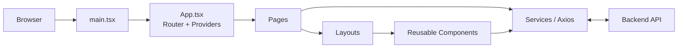
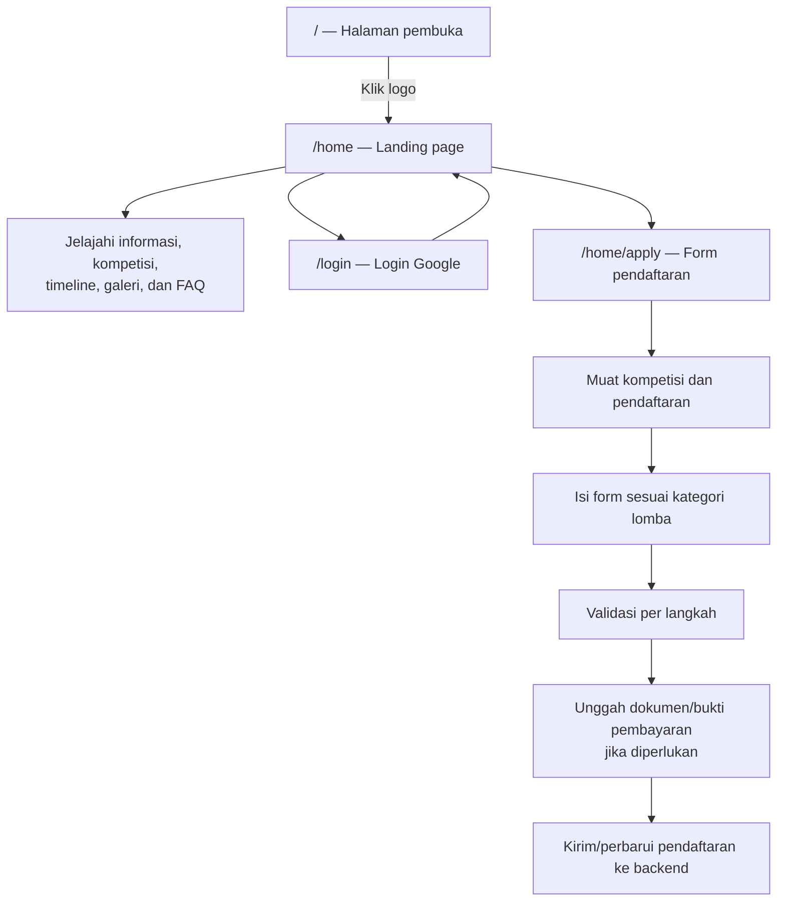
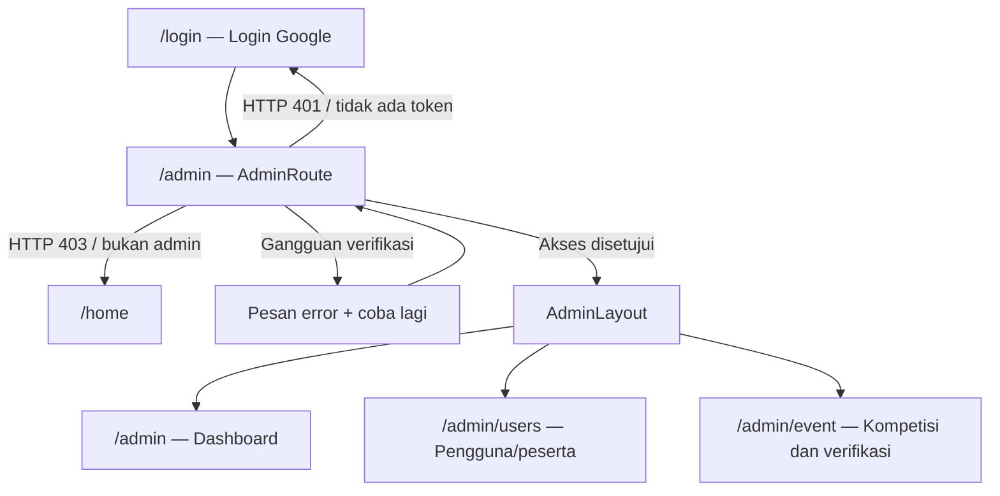

<p align="center">
  
</p>

<h1 align="center">FIRETECH 2026</h1>

<p align="center">
  <strong>Harmonizing Tech and Humanity</strong><br />
  Website event, registrasi kompetisi, dan panel administrasi dalam satu aplikasi.
</p>

<p align="center">
  
  
  
  
</p>

<p align="center">
  <a href="#fitur-utama">Fitur</a> ·
  <a href="#alur-aplikasi">Alur aplikasi</a> ·
  <a href="#struktur-folder">Struktur project</a> ·
  <a href="#menjalankan-project">Mulai menjalankan</a>
</p>

---

Frontend FIRETECH 2026 dibuat sebagai **Single Page Application (SPA)**. Pengunjung dapat menjelajahi informasi acara, peserta dapat mendaftar kompetisi, dan admin dapat mengelola data melalui panel khusus.

> **Gambaran singkat**
>
> `React + TypeScript` membangun antarmuka · `React Router` mengatur halaman · `services/` menghubungkan frontend dengan backend.

## Daftar isi

- [Fitur utama](#fitur-utama) · [Teknologi](#teknologi) · [Alur aplikasi](#alur-aplikasi)
- [Struktur folder](#struktur-folder) · [Penjelasan bagian dan file](#penjelasan-bagian-dan-file)
- [Menjalankan project](#menjalankan-project) · [Konfigurasi environment](#konfigurasi-environment)
- [Catatan pengembangan](#catatan-pengembangan)

## Fitur utama

| 🌐 Pengunjung                               | 🧑‍💻 Peserta                           | 🛠️ Admin                            |
| ------------------------------------------- | ---------------------------------------- | ------------------------------------- |
| Landing page dan informasi FIRETECH         | Login dengan Google OAuth                | Dashboard statistik                   |
| Kompetisi, timeline, countdown, galeri, FAQ | Pendaftaran Hackathon, UI/UX, E-Football | Pengelolaan pengguna dan kompetisi    |
| Sponsor dan media partner                   | Profil dan status pendaftaran            | Verifikasi KTM/dokumen dan pembayaran |
| Tema gelap/terang dan tampilan responsif    | Unggah bukti sesuai kebutuhan lomba      | Kelola data pendaftaran peserta       |

## Teknologi

| Teknologi                 | Penggunaan                          |
| ------------------------- | ----------------------------------- |
| React 19                  | Komponen dan antarmuka pengguna     |
| TypeScript                | Tipe statis untuk komponen dan data |
| Vite                      | Server pengembangan dan bundler     |
| Tailwind CSS 4            | Styling antarmuka                   |
| React Router              | Routing aplikasi                    |
| Axios                     | Komunikasi HTTP dengan backend      |
| Google OAuth              | Autentikasi Google                  |
| Framer Motion, AOS, GSAP  | Animasi dan transisi                |
| Lucide React, React Icons | Ikon                                |

## Alur aplikasi

### Peta halaman

| URL              | Halaman                               | Akses               |
| ---------------- | ------------------------------------- | ------------------- |
| `/`            | Pembuka FIRETECH                      | Publik              |
| `/home`        | Landing page dan informasi acara      | Pengunjung/peserta  |
| `/home/apply`  | Form pendaftaran kompetisi            | Peserta             |
| `/login`       | Login Google                          | Publik              |
| `/admin`       | Dashboard statistik                   | Admin terverifikasi |
| `/admin/users` | Pengelolaan pengguna/peserta          | Admin terverifikasi |
| `/admin/event` | Pengelolaan kompetisi dan pendaftaran | Admin terverifikasi |

### Arsitektur frontend



### Alur pengunjung dan peserta



### Alur admin



Route didefinisikan di `src/App.tsx`. Halaman pengguna menggunakan `MainLayout`; halaman admin menggunakan `AdminLayout` dan dilindungi komponen `AdminRoute`. Halaman serta komponen meminta data melalui fungsi pada `src/services/`, yang pada umumnya menggunakan Axios untuk berkomunikasi dengan backend.

## Struktur folder

<details>
<summary><strong>Klik untuk melihat pohon folder lengkap</strong></summary>

```text
FE-firetech2026/
├── public/                         File statis yang diakses langsung dari URL
├── src/
│   ├── api/                        Konfigurasi/helper API tambahan
│   ├── assets/                     Gambar, ikon, logo, dan video
│   ├── components/                 Komponen antarmuka yang digunakan ulang
│   │   ├── animations/             Konfigurasi animasi
│   │   ├── apply/                  Komponen form pendaftaran
│   │   ├── button/                 Tombol aksi
│   │   ├── card/                   Kartu kompetisi
│   │   ├── countdown/              Komponen countdown
│   │   ├── events/                 Tabel event dan peserta
│   │   ├── filter/                 Filter data
│   │   ├── footer/                 Bagian-bagian footer
│   │   ├── form/                   Form, modal, dan detail data
│   │   ├── navbar/                 Bagian-bagian navbar
│   │   ├── profile/                Komponen profil
│   │   ├── scenario/event/         Tampilan event interaktif
│   │   ├── section/
│   │   │   ├── divider/            Pemisah antarsection
│   │   │   └── user/               Section landing page
│   │   └── ui/                     Komponen UI umum
│   ├── config/                     Konfigurasi form dan validasi
│   ├── constants/                  Konstanta aplikasi
│   ├── context/                    State global React
│   ├── data/                       Data pendukung tampilan
│   ├── hooks/                      Custom React hooks
│   ├── layouts/                    Kerangka halaman pengguna dan admin
│   ├── pages/                      Halaman yang dipetakan ke route
│   │   ├── admin/                  Halaman admin
│   │   ├── auth/                   Halaman autentikasi
│   │   └── user/                   Halaman pengguna
│   ├── services/                   Fungsi komunikasi dengan backend
│   ├── types/                      Tipe dan struktur data TypeScript
│   ├── utils/                      Helper umum
│   ├── App.css                     CSS tingkat aplikasi
│   ├── App.tsx                     Provider dan konfigurasi route
│   ├── index.css                   CSS global dan Tailwind
│   └── main.tsx                    Bootstrap/render React
├── index.html                      HTML awal dan metadata situs
├── package.json                    Dependency dan scripts npm
├── vite.config.ts                  Konfigurasi Vite, React, dan Tailwind
├── eslint.config.js                Konfigurasi ESLint
├── tsconfig.json                   Konfigurasi TypeScript utama
├── tsconfig.app.json               Konfigurasi TypeScript aplikasi
├── tsconfig.node.json              Konfigurasi TypeScript untuk tooling
├── vercel.json                     Konfigurasi deployment Vercel
└── README.md                       Dokumentasi project
```

</details>

## Penjelasan bagian dan file

### File root dan entry point

| Ikon | File                                                             | Fungsi                                                                                               |
| :--: | ---------------------------------------------------------------- | ---------------------------------------------------------------------------------------------------- |
|  🌐  | `index.html`                                                   | Dokumen awal situs: metadata, elemen`root`, dan entry script aplikasi.                             |
| ⚛️ | `src/main.tsx`                                                 | Memasang aplikasi React ke elemen`root` menggunakan `createRoot`.                                |
|  🧭  | `src/App.tsx`                                                  | Memasang provider Google OAuth dan tema, mendefinisikan route, loading awal, serta inisialisasi AOS. |
|  🎨  | `src/App.css`                                                  | Styling khusus tingkat aplikasi.                                                                     |
| 🖌️ | `src/index.css`                                                | Import Tailwind dan font, styling global, tema gelap, serta animasi CSS.                             |
|  📦  | `package.json`                                                 | Daftar dependency dan perintah npm seperti`dev`, `build`, `lint`, dan `preview`.             |
|  ⚡  | `vite.config.ts`                                               | Mengaktifkan plugin React dan Tailwind untuk Vite.                                                   |
|  🧹  | `eslint.config.js`                                             | Aturan lint untuk JavaScript/TypeScript dan React.                                                   |
|  🔤  | `tsconfig.json`, `tsconfig.app.json`, `tsconfig.node.json` | Pengaturan pemeriksaan dan kompilasi TypeScript.                                                     |
| ☁️ | `vercel.json`                                                  | Pengaturan deployment pada Vercel.                                                                   |

### Halaman (`src/pages/`)

| Ikon | File                    | Fungsi                                                                                        |
| :--: | ----------------------- | --------------------------------------------------------------------------------------------- |
|  🔥  | `firetech.tsx`        | Halaman pembuka`/`, menampilkan logo dan ajakan masuk ke halaman utama.                     |
|  🚫  | `notfound.tsx`        | Halaman untuk alamat/route yang tidak ditemukan.                                              |
|  🔐  | `auth/login.tsx`      | Login Google dan penyimpanan token serta informasi pengguna setelah autentikasi berhasil.     |
|  🏠  | `user/home.tsx`       | Menyusun landing page dari section informasi acara.                                           |
|  📝  | `user/apply.tsx`      | Mengelola pemuatan data, form, validasi, unggah berkas, dan pengiriman/perubahan pendaftaran. |
|  📊  | `admin/dashboard.tsx` | Mengambil data kompetisi dan pendaftaran untuk menampilkan statistik admin.                   |
|  👥  | `admin/user.tsx`      | Melihat dan mengelola informasi pengguna/peserta.                                             |
|  🏆  | `admin/event.tsx`     | Mengelola kompetisi, pendaftar, dan proses verifikasi.                                        |

### Layout (`src/layouts/`)

| Ikon | File                | Fungsi                                                                                                                 |
| :--: | ------------------- | ---------------------------------------------------------------------------------------------------------------------- |
|  🧱  | `mainlayout.tsx`  | Kerangka pengguna: navbar, konten route (`Outlet`), footer, tombol kembali ke atas, latar tema, dan progress scroll. |
| 🛡️ | `adminlayout.tsx` | Kerangka panel admin: latar, navbar admin, dan area konten route.                                                      |

### Komponen (`src/components/`)

<details>
<summary><strong>Lihat inventaris komponen UI</strong></summary>

|      Ikon      | File                                       | Fungsi                                                                                               |
| :------------: | ------------------------------------------ | ---------------------------------------------------------------------------------------------------- |
|      🛡️      | `AdminRoute.tsx`                         | Memeriksa akses admin melalui backend; menangani status loading, unauthorized, forbidden, dan error. |
|       🦶       | `footer.tsx`                             | Footer utama situs.                                                                                  |
|       ⏳       | `loading.tsx`                            | Tampilan loading awal.                                                                               |
|       🧭       | `navbar.tsx`                             | Navigasi pengguna, profil, status pendaftaran, dan menu.                                             |
|      🛠️      | `navbaradmin.tsx`                        | Navigasi panel admin.                                                                                |
|       📄       | `pagination.tsx`                         | Kontrol navigasi data berhalaman.                                                                    |
|      ↕️      | `scrolltotop.tsx`                        | Mengatur perilaku scroll saat berpindah route.                                                       |
|       🌓       | `themeswitcher.tsx`                      | Kontrol pergantian tema.                                                                             |
|      🎞️      | `animations/headingvariants.ts`          | Varian animasi heading.                                                                              |
|      🎞️      | `animations/timeline.ts`                 | Konfigurasi animasi timeline.                                                                        |
|       👥       | `apply/addmember.tsx`                    | Bagian form untuk menambahkan anggota tim.                                                           |
|       👥       | `apply/addolympiadmember.tsx`            | Input anggota untuk format olimpiade.                                                                |
|       🎮       | `apply/efootballform.tsx`                | Form pendaftaran E-Football.                                                                         |
|       🧩       | `apply/formfield.tsx`                    | Field/input reusable untuk form pendaftaran.                                                         |
|       💻       | `apply/hackathonform.tsx`                | Form pendaftaran Hackathon.                                                                          |
|       💳       | `apply/payment.tsx`                      | Bagian pembayaran atau bukti pembayaran.                                                             |
|       🪜       | `apply/placeholderstep.tsx`              | Placeholder untuk langkah form.                                                                      |
|       📶       | `apply/registrationprogres.tsx`          | Indikator progres langkah pendaftaran.                                                               |
|       🎨       | `apply/uiuxform.tsx`                     | Form pendaftaran UI/UX.                                                                              |
|      ⬆️      | `button/arrow.tsx`                       | Tombol panah/aksi scroll.                                                                            |
|       📞       | `button/call.tsx`                        | Tombol kontak/panggilan.                                                                             |
|       🔑       | `button/login.tsx`                       | Tombol login.                                                                                        |
|       🚪       | `button/logout.tsx`                      | Tombol logout.                                                                                       |
|      ♻️      | `button/reset.tsx`                       | Tombol reset.                                                                                        |
|       🃏       | `card/competitioncard.tsx`               | Kartu informasi kompetisi.                                                                           |
|       🔢       | `countdown/animateddigit.tsx`            | Digit countdown beranimasi.                                                                          |
|      ⏱️      | `countdown/card.tsx`                     | Tampilan kartu countdown.                                                                            |
|       🏆       | `events/tableevent.tsx`                  | Tabel data kompetisi/event.                                                                          |
|   🧑‍🤝‍🧑   | `events/tableparticipant.tsx`            | Tabel data peserta.                                                                                  |
|       🔎       | `filter/filter.tsx`                      | Kontrol filter data.                                                                                 |
|       🌐       | `footer/connect.tsx`                     | Informasi koneksi dan media sosial pada footer.                                                      |
| 👨‍👩‍👧‍👦 | `footer/ourteam.tsx`                     | Informasi tim pada footer.                                                                           |
|       🔗       | `footer/quicklink.tsx`                   | Tautan cepat pada footer.                                                                            |
|       ➕       | `form/addevent.tsx`                      | Form penambahan event.                                                                               |
|       👤       | `form/adminprofilemodal.tsx`             | Modal profil untuk konteks admin.                                                                    |
|      🗑️      | `form/delete.tsx`                        | Modal konfirmasi penghapusan.                                                                        |
|      ✏️      | `form/editevent.tsx`                     | Form edit event.                                                                                     |
|      ✏️      | `form/editprofile.tsx`                   | Form edit profil.                                                                                    |
|      ✏️      | `form/edituser.tsx`                      | Form edit pengguna.                                                                                  |
|      ℹ️      | `form/eventdetailmodal.tsx`              | Modal detail event.                                                                                  |
|       🧩       | `form/field.tsx`                         | Field reusable untuk form umum.                                                                      |
|       👤       | `form/profilemodal.tsx`                  | Modal profil pengguna.                                                                               |
|       🔄       | `form/registrationtogglemodal.tsx`       | Modal perubahan/toggle status pendaftaran.                                                           |
|      🏷️      | `form/statusselect.tsx`                  | Kontrol pemilihan status.                                                                            |
|       📋       | `form/userdetailmodal.tsx`               | Modal detail pendaftar/pengguna.                                                                     |
|       🏆       | `form/userdetail/competitionsection.tsx` | Informasi kompetisi pada detail pengguna.                                                            |
|       📝       | `form/userdetail/infoline.tsx`           | Baris informasi ringkas.                                                                             |
|       📎       | `form/userdetail/proofssection.tsx`      | Dokumen/bukti pada detail pengguna.                                                                  |
|      🗂️      | `form/userdetail/sectioncard.tsx`        | Wadah kartu untuk bagian detail.                                                                     |
|       👤       | `form/userdetail/userinfosection.tsx`    | Informasi pengguna pada tampilan detail.                                                             |
|      🎛️      | `navbar/actions.tsx`                     | Tombol aksi navbar.                                                                                  |
|       🧭       | `navbar/menu.tsx`                        | Menu navigasi desktop.                                                                               |
|       🪟       | `navbar/modalcontainer.tsx`              | Wadah modal terkait navbar.                                                                          |
|       👤       | `navbar/userprofilebutton.tsx`           | Tombol profil pengguna pada navbar.                                                                  |
|      ⚠️      | `profile/profilealert.tsx`               | Peringatan/notifikasi profil.                                                                        |
|       🪪       | `profile/profileitem.tsx`                | Item informasi profil.                                                                               |
|      👁️      | `profile/profilepreview.tsx`             | Ringkasan/preview profil.                                                                            |
|       📱       | `scenario/event/eventcardmobile.tsx`     | Kartu event untuk tampilan mobile.                                                                   |
|       📱       | `scenario/event/eventmodalmobile.tsx`    | Modal event untuk tampilan mobile.                                                                   |
|      🎞️      | `scenario/event/eventslide.tsx`          | Slide tampilan event.                                                                                |
|       🎬       | `scenario/event/scenario1.tsx`           | Komposisi/skenario tampilan event.                                                                   |
|       ➖       | `section/divider/sectiondivider.tsx`     | Pemisah antarsection.                                                                                |
|      ⏱️      | `section/user/countdown.tsx`             | Section countdown landing page.                                                                      |
|       🚀       | `section/user/dashboard.tsx`             | Section hero/dashboard landing page.                                                                 |
|       🏆       | `section/user/event.tsx`                 | Section daftar kompetisi.                                                                            |
|       ❓       | `section/user/faq.tsx`                   | Section FAQ.                                                                                         |
|       🔥       | `section/user/firetech.tsx`              | Section pengenalan FIRETECH.                                                                         |
|      🖼️      | `section/user/gallery.tsx`               | Section galeri.                                                                                      |
|       📣       | `section/user/mediapartner.tsx`          | Section media partner.                                                                               |
|       🤝       | `section/user/sponsor.tsx`               | Section sponsor.                                                                                     |
|      🗓️      | `section/user/timeline.tsx`              | Section timeline acara.                                                                              |
|      🏷️      | `ui/badge.tsx`                           | Label/badge status.                                                                                  |
|       ✅       | `ui/checkpoint.tsx`                      | Indikator checkpoint/status.                                                                         |
|       📅       | `ui/datepicker.tsx`                      | Kontrol pemilihan tanggal.                                                                           |
|       📤       | `ui/fileupload.tsx`                      | Kontrol unggah berkas.                                                                               |
|       🔔       | `ui/toast.tsx`                           | Notifikasi singkat.                                                                                  |
|       💬       | `ui/tooltip.tsx`                         | Tooltip.                                                                                             |

</details>

### API, service, dan akses data

| Ikon | File                                      | Fungsi                                                                                                                                           |
| :--: | ----------------------------------------- | ------------------------------------------------------------------------------------------------------------------------------------------------ |
|  🔌  | `src/services/api.ts`                   | Instance Axios utama: base URL dari`VITE_API_URL`, credentials, dan token akses pada request.                                                  |
|  🔐  | `src/services/auth.services.ts`         | Operasi login Google, logout, dan refresh token.                                                                                                 |
|  🏆  | `src/services/competition.services.ts`  | Mengambil daftar/detail kompetisi, memperbarui kompetisi, dan memeriksa akses admin.                                                             |
|  📝  | `src/services/registration.services.ts` | Pendaftaran/perubahan pendaftaran, detail, unggah/unduh file, verifikasi KTM/pembayaran, dan penghapusan.                                        |
|  👥  | `src/services/user.services.ts`         | Mengambil daftar/detail pengguna dan mencari nomor telepon dari berbagai bentuk data.                                                            |
|  🪪  | `src/services/profile.services.ts`      | Mengambil dan memperbarui profil.                                                                                                                |
|  📚  | `src/services/pagination.ts`            | Membantu mengambil seluruh halaman dari endpoint paginasi.                                                                                       |
|  🔌  | `src/api/axios.ts`                      | File Axios tambahan. Periksa referensi pemakaiannya sebelum mengubah atau menghapus; jangan menganggapnya identik dengan`src/services/api.ts`. |

### Konfigurasi, tipe, dan state

| Ikon | File                              | Fungsi                                                                   |
| :--: | --------------------------------- | ------------------------------------------------------------------------ |
| ⚙️ | `src/config/applyformconfig.ts` | Nilai awal, daftar langkah, dan komponen form tiap kategori pendaftaran. |
|  ✅  | `src/config/applyvalidation.ts` | Field wajib, label field, dan fungsi validasi per langkah.               |
|  🏆  | `src/constants/event.ts`        | Konstanta yang berkaitan dengan event.                                   |
|  📐  | `src/constants/layout.ts`       | Konstanta yang berkaitan dengan layout.                                  |
|  🎨  | `src/context/themecontext.tsx`  | State tema global dan hook`useTheme`.                                  |
| 🗓️ | `src/data/timeline.ts`          | Data timeline untuk tampilan.                                            |
|  👤  | `src/data/user.ts`              | Data/struktur pendukung tampilan pengguna.                               |
|  🪝  | `src/hooks/useUserProfile.ts`   | Hook untuk membaca dan memperbarui profil pengguna.                      |
|  🧾  | `src/types/applysevent.ts`      | Tipe kategori dan data form kompetisi.                                   |
|  👥  | `src/types/user.ts`             | Tipe pengguna dan status terkait.                                        |
|  💾  | `src/utils/cache.ts`            | Helper cache.                                                            |
| 🎞️ | `src/utils/gsap.ts`             | Helper penggunaan GSAP.                                                  |
| 🏷️ | `src/utils/status.ts`           | Helper pemetaan atau pemformatan status.                                 |

### Aset dan file statis

| Ikon | Folder/file                     | Fungsi                                                                                                           |
| :--: | ------------------------------- | ---------------------------------------------------------------------------------------------------------------- |
| 🖼️ | `src/assets/admin/dashboard/` | Ikon statistik dashboard admin.                                                                                  |
|  ➖  | `src/assets/divider/`         | Gambar dekorasi pemisah section dan variasi warnanya.                                                            |
|  🏆  | `src/assets/event/`           | Gambar kompetisi.                                                                                                |
|  📸  | `src/assets/gallery/`         | Gambar galeri.                                                                                                   |
|  📣  | `src/assets/mediapartner/`    | Logo media partner.                                                                                              |
|  📱  | `src/assets/socialmedia/`     | Ikon media sosial.                                                                                               |
|  🤝  | `src/assets/sponsor/`         | Logo sponsor.                                                                                                    |
| 🗓️ | `src/assets/timeline/`        | Ilustrasi timeline.                                                                                              |
|  🎬  | `src/assets/`                 | Aset tingkat atas seperti logo FIRETECH, identitas penyelenggara, ilustrasi, QR, dan video.                      |
|  📂  | `public/`                     | File statis yang dilayani langsung, seperti`firetech.webp`, `robots.txt`, `sitemap.xml`, dan `vite.svg`. |

## Menjalankan project

Pastikan Node.js dan npm tersedia. Jalankan dari direktori project:

```bash
npm install
npm run dev
```

Vite akan menampilkan alamat lokal di terminal. Buka alamat tersebut di browser untuk melihat aplikasi.

<details>
<summary><strong>Perintah pengembangan lainnya</strong></summary>

```bash
npm run build    # pemeriksaan TypeScript dan build produksi
npm run lint     # pemeriksaan ESLint
npm run preview  # preview hasil build secara lokal
```

</details>

Hasil build produksi dibuat di folder `dist/`. Folder `node_modules/` merupakan dependency lokal; keduanya bukan source utama aplikasi.

## Konfigurasi environment

Buat file `.env` lokal di root project dan isi nilai yang sesuai dengan backend serta konfigurasi Google OAuth:

```dotenv
VITE_API_URL=https://alamat-backend-anda
VITE_GOOGLE_CLIENT_ID=client-id-google-anda
```

Nama variabel harus memakai awalan `VITE_` agar dapat dibaca oleh aplikasi Vite melalui `import.meta.env`. Gunakan nilai dari konfigurasi environment/deployment yang benar. **Jangan commit secret, token, atau kredensial ke Git.** Client ID OAuth adalah konfigurasi publik untuk browser, tetapi tetap harus disesuaikan dengan pengaturan OAuth yang berlaku.

## Catatan pengembangan

| Jika ingin mengubah...                    | Mulai periksa di...                                                                          |
| ----------------------------------------- | -------------------------------------------------------------------------------------------- |
| URL endpoint atau header request          | `src/services/`                                                                            |
| Field, langkah, atau validasi pendaftaran | `src/config/`, `src/types/`, `src/components/apply/`, dan `src/pages/user/apply.tsx` |
| Route atau layout halaman                 | `src/App.tsx` dan `src/layouts/`                                                         |
| Hak akses admin                           | `src/components/AdminRoute.tsx` dan endpoint backend yang memeriksa akses                  |
| Gambar, logo, atau video                  | `src/assets/` atau `public/` sesuai cara file digunakan                                  |

> **Catatan:** README ini menjelaskan frontend. Kontrak endpoint, validasi final, dan otorisasi tetap menjadi tanggung jawab backend. Jangan mengedit `dist/` atau `node_modules/` sebagai pengganti source di `src/`.

<p align="center">
  <sub>FIRETECH 2026 · Frontend documentation</sub>
</p>
